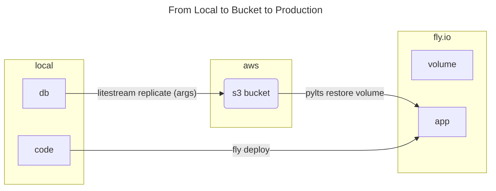
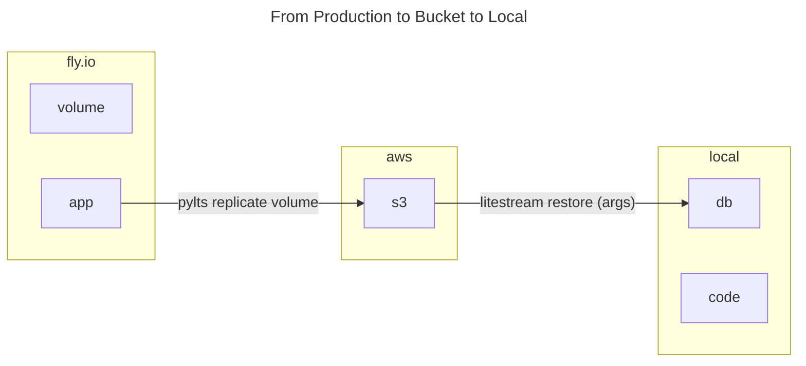

# pylts Docs

A thin, reusable [pydantic](https://docs.pydantic.dev) wrapper over [litestream](https://litestream.io/)
applied specifically to an s3 bucket.

This makes it easier to use litestream inside a python script to handle the _replicate_ and _restore_ aspects of this flow:

Environment | Task
--:|:--
local | Set up _repo_ with a _sqlite.db_ (`db`)
local | With `pydantic`-parsed values, `litestream replicate` this created `db` to `s3`
local | Deploy the _repo_ to `fly.io`
prod | Pydantically restore `db` from `s3` to `fly.io`

The database that is (re)stored in the volume (fly.io) may be updated either by cron jobs or by adding, deleting entries directly. How do we ensure these updates are persisted to the s3 bucket?

## Steps

1. Add fields from s3 bucket to `.env`
2. `.env` picked up by Pydantic BaseSettings model
3. Python subprocesses to litestream replicate/restore use BaseSettings

## Configuration

::: pylts.aws.ConfigS3
